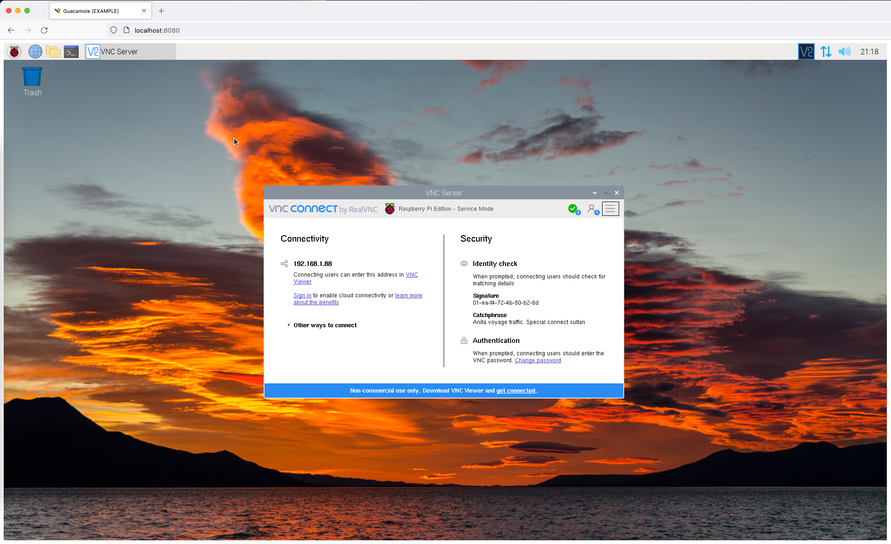

# Guacamole Simple sample server with docker

Simple tunnel example with hard coded parameters.

Inspired by projects:
- [juazugas/guacamole-example](https://github.com/juazugas/guacamole-example)
- [guacamole/guacamole-client/doc/guacamole-example](https://github.com/apache/guacamole-client/tree/master/doc/guacamole-example)


### Development

Clone this repository and compile the sources.

```
docker-compose build
```


To launch the example you can run the application with

```
docker-compose up
```

Navigate to

```
http://localhost:8080/
```



### Logging

The logging can be configured using the Java Option property for thorntail logging. See Dockerfile (more information can be in the Thorntail documentation):

`-Dthorntail.logging=FINE`

### Requisites

You need a vnc server running, and the guacamole server with network connection to the vnc server.

### Resources

- Guacamole-client Github Sources
  https://github.com/apache/guacamole-client/

- Guacamole FAQ.
  https://guacamole.apache.org/faq/#iframes

- Guacamole with docker.
  https://guacamole.apache.org/doc/gug/guacamole-docker.html

- Thorntail Documentation (version 2.5.0.Final)
  https://docs.thorntail.io/2.5.0.Final/#_web
